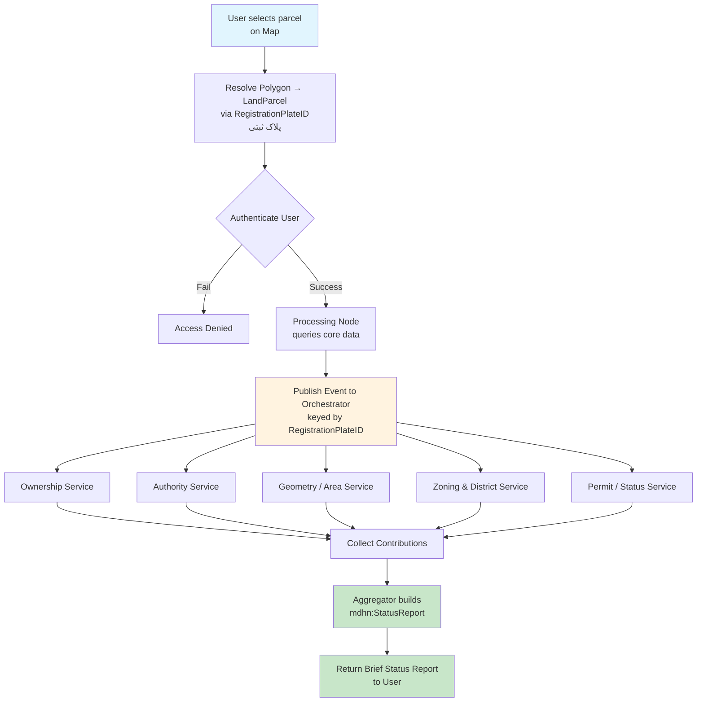
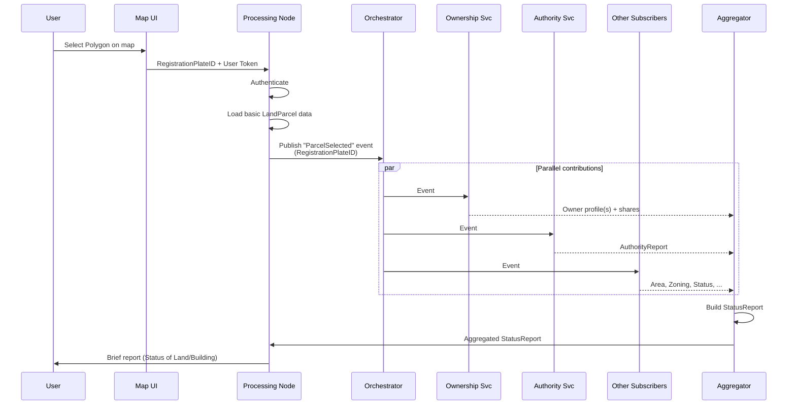
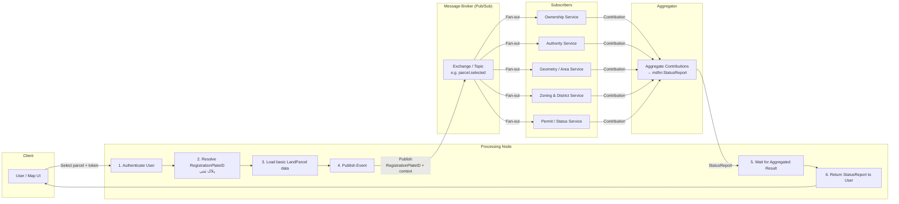

# Tehran Construction Ontology & Distributed Map-Based Platform

**Private repository** – Ontology-driven foundation for a distributed, map-based construction permitting and compliance application focused on Tehran Municipality.

## Vision

Tehran is Iran’s largest city and one of the most complex urban environments for construction. Building regulations, zoning rules, geotechnical requirements, and administrative procedures vary significantly across its **22 municipal districts (مناطق)**.  

This project treats an **OWL ontology** as the single ubiquitous language shared between:
- Business domain experts (municipality officers, architects, geotechnical engineers)
- Technical teams (developers, data engineers, GIS specialists)

The ontology starts from the **Building Topology Ontology (BOT)** and is systematically extended to cover:
- Administrative geography of Tehran
- Construction documents, plans, and design artefacts
- Materials and BIM data (especially from Autodesk Revit / IFC)
- Municipal policies and rules
- Workflows and permit processes

A rule engine (SHACL + SPARQL / external engine) evaluates applications against location-specific policies. The map interface becomes a pure visualization and interaction layer over the knowledge graph.

## Problem Statement

- Construction rules differ by district.
- Physical building topology, legal parcels, design documents, geotechnical reports, foundation designs, and material specifications must stay linked.
- Stakeholders need a shared, precise vocabulary.
- The system must support distributed data (different districts / teams can maintain their own named graphs) while remaining interoperable.
- Future national or municipal code changes should be additive, not disruptive.

## Design Principles

1. **BOT remains pure** – It only describes physical topology and containment.
2. **Modular extension** – New concerns live in separate ontology modules that reference BOT entities.
3. **Ubiquitous language first** – Classes and properties are chosen so both domain experts and developers can use the same terms.
4. **Rule-engine friendly** – Policies are first-class citizens that can be queried and evaluated.
5. **Map-native** – Every relevant entity can carry GeoSPARQL geometry.
6. **BIM-aware** – Revit / IFC models and their materials are first-class information resources linked to the topology.

## Ontology Architecture (Layered)

```
┌─────────────────────────────────────────────────────────┐
│  Process / Workflow Layer                               │
│  (PermitApplication, Workflow, Step, State, Decision)   │
├─────────────────────────────────────────────────────────┤
│  Regulatory & Policy Layer                              │
│  (MunicipalPolicy, ConstructionRule, Constraint)        │
├─────────────────────────────────────────────────────────┤
│  Design & Documentation Layer                           │
│  (Plans, Geotechnical reports, Foundation designs,      │
│   BIM models, Material specifications)                  │
├─────────────────────────────────────────────────────────┤
│  Material & Product Layer                               │
│  (Material, BuildingProduct – Revit families / IFC)     │
├─────────────────────────────────────────────────────────┤
│  Administrative & Spatial Layer                         │
│  (District, Sub-district, LandParcel, ZoningClass)      │
├─────────────────────────────────────────────────────────┤
│  Core Topology – BOT (unchanged)                        │
│  Site → Building → Storey → Space → Element             │
└─────────────────────────────────────────────────────────┘
         + GeoSPARQL geometries on spatial entities
```


### 1. TTL file (combined entry point)


### 2. Brief version already added to README

**Ontology at a Glance (Brief)**

We keep the official **Building Topology Ontology (BOT)** pure for physical structure  
(`bot:Site` → `bot:Building` → `bot:Storey` → `bot:Space` → `bot:Element`).

Two extension modules add the rest of the domain:

| Module | File | Main content |
|--------|------|--------------|
| **Core** | `ontology/mdhn-core.ttl` | 22 Administrative Districts, Land Parcels, Zoning Classes + spatial relations + GeoSPARQL readiness |
| **Documentation** | `ontology/mdhn-documentation.ttl` | Plans, Geotechnical Reports, Foundation Designs, BIM Models (Revit/IFC), Materials + typed links to BOT entities |
| **Full entry point** | `ontology/mdhn-full.ttl` | Imports both modules + BOT |

**Key linking pattern**  
Documents and materials are attached to the most specific BOT entity possible:

- Site / Parcel → Geotechnical report, Site plan, Zoning map  
- Building → Foundation design, Architectural & Structural plans, BIM model  
- Element → Material / Product type  

This keeps the rule engine simple (“does this building in District 5 have an approved FoundationDesign?”) and the map UI rich (click → topology + all attached documents).

---

### 1. Core – Building Topology Ontology (BOT)

Namespace: `https://w3id.org/bot#`  
Prefix: `bot:`

We keep BOT completely intact. Key classes used:
- `bot:Zone` (superclass)
- `bot:Site`
- `bot:Building`
- `bot:Storey`
- `bot:Space`
- `bot:Element`
- `bot:Interface`

BOT already provides `bot:has3DModel` and `bot:hasSimple3DModel` – useful hooks for geometry coming from Revit/IFC.

### 2. Administrative & Spatial Extensions

New classes (namespace `mdhn:`):
- `mdhn:AdministrativeDistrict` – the 22 مناطق of Tehran
- `mdhn:SubDistrict` / `mdhn:Neighborhood`
- `mdhn:LandParcel` – cadastral unit
- `mdhn:ZoningClass`

Key relations:
- `mdhn:locatedInDistrict`
- `mdhn:subjectToZoning`
- `bot:containsZone` refined with district-level containment
- GeoSPARQL (`geo:hasGeometry`, `geo:asWKT`) on sites, parcels, and districts

### 3. Design & Documentation Layer

This is the major extension requested for maps, plans, geotechnical documents, foundation designs, and BIM artefacts.

**Classes**
- `mdhn:InformationResource` (superclass)
  - `mdhn:DesignDocument`
    - `mdhn:ArchitecturalPlan`
    - `mdhn:StructuralPlan`
    - `mdhn:FoundationDesign`
    - `mdhn:GeotechnicalReport`
    - `mdhn:SitePlan` / `mdhn:ZoningMap` / `mdhn:CadastralMap`
  - `mdhn:BIMModel` (Revit project, IFC file, etc.)
  - `mdhn:MaterialSpecification`

**Properties** (can attach to any `bot:Zone` or `bot:Element`)
- Generic: `mdhn:hasInformationResource` / `mdhn:documents`
- Typed (preferred for rules and UI):
  - `mdhn:hasFoundationDesign`
  - `mdhn:hasGeotechnicalReport`
  - `mdhn:hasArchitecturalPlan`
  - `mdhn:hasStructuralPlan`
  - `mdhn:hasSitePlan`
  - `mdhn:hasBIMModel`

Document metadata:
- File / IIIF / download URI
- `dcterms:format`, `dcterms:created`, `dcterms:creator`
- Provenance (`prov:wasGeneratedBy` – software, author, approval status)
- Versioning (`mdhn:version`, `mdhn:supersedes`)

**Typical attachment points**

| BOT entity              | Typical attached resources                                      |
|-------------------------|-----------------------------------------------------------------|
| `bot:Site` / Parcel     | Geotechnical reports, cadastral & zoning maps, site plans       |
| `bot:Building`          | Foundation design, architectural & structural plans, main BIM model |
| `bot:Storey` / `bot:Space` | Floor plans, detailed drawings                               |
| `bot:Element`           | Material specifications, detailed Revit element data            |

### 4. Material & Product Layer

- `mdhn:Material`
- `mdhn:BuildingProduct` (Revit family/type, IFC type, manufacturer product)

Relations:
- `mdhn:hasMaterial` (domain usually `bot:Element`)
- `mdhn:hasProductType`

Properties can include Iranian standard codes, strength class, density, fire rating, etc.

**Revit / BIM integration strategy**
1. The Revit (or IFC) file itself is recorded as an `mdhn:BIMModel` linked to the building or site.
2. An import pipeline materialises the topology into BOT + material/product instances.
3. Geometry can additionally be linked via BOT’s own `bot:has3DModel`.

### 5. Regulatory & Policy Layer

- `mdhn:MunicipalPolicy`
- `mdhn:ConstructionRule`
- `mdhn:Constraint` / `mdhn:Requirement`

Important properties:
- `mdhn:appliesToDistrict`
- `mdhn:appliesToBuildingType`
- `mdhn:appliesToHeightRange` / floor-area range
- `mdhn:effectiveFrom` / `mdhn:supersededBy`
- Link to official circular / article number

This turns the “22 different rule sets” into queryable, versionable RDF.

### 6. Process / Workflow Layer

- `mdhn:PermitApplication`
- `mdhn:Workflow`
- `mdhn:WorkflowStep` / `mdhn:DecisionPoint`
- `mdhn:State` (Submitted, UnderReview, NeedsRevision, Approved, Rejected, Suspended…)

Links back to spatial and regulatory layers (`mdhn:concernsParcel`, `mdhn:evaluatedAgainstRule`).

### 7. Actor Layer

Simple role model: Applicant, LicensedEngineer, DistrictOfficer, CentralMunicipalityReviewer, Inspector, etc.

## Rule Engine Strategy

OWL alone is insufficient for production rules. Recommended hybrid:

- **SHACL** for structural constraints and cardinality.
- **SPARQL** (or SWRL for lighter cases) for policy logic.
- External rule engine (Drools, or a lightweight service) that:
  1. Receives the application + location + building parameters as a knowledge-graph fragment.
  2. Retrieves all applicable `mdhn:ConstructionRule` instances for that district.
  3. Evaluates them and writes results back as RDF (`mdhn:violatesRule`, `mdhn:satisfiesRequirement`, `mdhn:requiresDocument`).

Because documents and materials are explicitly linked, rules can require the existence and validity of specific artefacts (e.g. “District 5 + height > X → current FoundationDesign + GeotechnicalReport must exist”).

## Map Integration

- Every `bot:Site`, `mdhn:LandParcel`, and `mdhn:AdministrativeDistrict` carries GeoSPARQL geometry.
- The frontend map (Leaflet / OpenLayers / Mapbox / custom) is a pure consumer of the spatial topology + attached documents.
- Clicking a parcel or building immediately surfaces district, applicable zoning, current rules, and all linked plans / reports / materials.

## Repository Structure (proposed)

```
├── README.md                          ← this file
├── ontology/
│   ├── bot/                           ← local copy or reference to official BOT
│   ├── mdhn-core.ttl                  ← administrative + spatial extensions
│   ├── mdhn-documentation.ttl         ← plans, geotech, foundation, BIM models
│   ├── mdhn-materials.ttl             ← materials & products
│   ├── mdhn-policy.ttl                ← rules & policies
│   ├── mdhn-workflow.ttl              ← processes & states
│   └── mdhn-full.ttl                  ← imports everything
├── examples/
│   ├── sample-building.ttl
│   ├── sample-permit-application.ttl
│   └── queries/
├── shapes/                            ← SHACL shapes
├── docs/
│   ├── ontology-overview.md
│   ├── competency-questions.md
│   └── alignment-notes.md
└── scripts/
    └── (import pipelines, Revit/IFC converters, etc.)
```

## Current Status & Next Steps

**Done (conceptual design)**
- Decision to base topology on BOT
- Layered architecture defined
- Documentation & material extension pattern agreed
- Attachment points for maps, plans, geotechnical reports, foundation designs, and Revit data specified
- Rule-engine and map strategy outlined

**Immediate next actions**
1. Formalise the first Turtle modules (`mdhn-core` + `mdhn-documentation`).
2. Write a small set of competency questions and corresponding SPARQL/SHACL examples.
3. Model 1–2 real Tehran district differences as sample rules.
4. Define the minimal set of mandatory document types for the main permit workflows.
5. Sketch the import pipeline from Revit / IFC into BOT + mdhn modules.

## Namespace

```turtle
@prefix bot:  <https://w3id.org/bot#> .
@prefix mdhn: <https://w3id.org/mdhn/tehran-construction#> .   # provisional – adjust as needed
@prefix geo:  <http://www.opengis.net/ont/geosparql#> .
@prefix dcterms: <http://purl.org/dc/terms/> .
@prefix prov: <http://www.w3.org/ns/prov#> .
```
---


## Simple flow in an Ontology-based approach




### Sequence view (more detailed):


### Processing Node + Message Broker (Publisher/Subscriber)
Here is a clean, focused diagram of the node we are discussing and its interaction with the message broker:


# UI proposal 

# Parcel selection & status report
*From map click to a Material status report, keyed by Registration Plate ID*

## 1. Purpose

This document proposes the first end-to-end screen pair for the Tehran Construction Ontology & Distributed Map-Based Platform: selecting a land parcel on the map, and viewing its aggregated status report. It follows the flow already defined in the DCWProposal architecture, where a map click resolves to a LandParcel via its Registration Plate ID (پلاک ثبتی), and a fan-out of subscriber services contributes ownership, authority, geometry, zoning, and permit data that an aggregator assembles into a single status report.

Two mockups are included: a low-fidelity wireframe for the exploration/selection screen, and a Material Design treatment for the resulting status report. Both are provided as standalone HTML files that render pixel-for-pixel and can be exported as PNG images (open the file in a browser and take a screenshot, or use a URL-to-image tool) or imported into Figma via any HTML-to-Figma plugin.

## 2. Recap of the underlying architecture

The platform's ontology treats Building Topology Ontology (BOT) as the physical-topology core, extended with an `mdhn:` module for districts, land parcels, zoning, documents, materials, policy, and workflow. The screens in this proposal sit on top of the "simple flow" already defined for parcel selection:

- User selects a polygon on the map.
- The client resolves that polygon to a LandParcel using its Registration Plate ID.
- The user is authenticated before anything proceeds; failure shows Access denied.
- A processing node publishes a `parcel.selected` event, keyed by the Registration Plate ID, to a message broker.
- Ownership, Authority, Geometry/Area, Zoning & District, and Permit/Status services subscribe and each contribute a fragment.
- An aggregator assembles the fragments into an `mdhn:StatusReport` and returns it to the user.

*The two screens below correspond to the first step (selection) and the last step (status report) of that flow.*

## 3. Screen 1 — Parcel selection (wireframe)

Deliberately kept low-fidelity so the team can agree on structure and interaction before investing in visual polish. Sketch-style annotations mark the parts of the flow that are backed by the pub/sub architecture rather than plain UI state.

*Fig. 1 — Wireframe sketch: map with selectable parcels, search by Registration Plate ID, and the resulting selection panel.*

### Key elements

- **Search field** — looks up a parcel directly by Registration Plate ID, as an alternative to clicking the map.
- **Map canvas** — district boundary shown as a soft outline; individual parcels are tappable polygons; the active selection is highlighted.
- **Selection panel** — surfaces the resolved Registration Plate ID and district immediately, while area and further detail are marked pending until the status-report services respond.
- **Sign-in state** — shown persistently in the top bar; an annotation calls out that selection on an unauthenticated session should short-circuit to Access denied, per the architecture's authentication gate.
- **"Behind the click" checklist** — a design-only annotation, not shipped UI, tracing which of the five pipeline steps a given interaction has reached, to keep the mockup honest about latency (the aggregate step is not instant).

## 4. Screen 2 — Status report (Material view)

Once the aggregator returns a status report, the interface shifts from sketch exploration to a production-quality Material Design surface. Each card on the screen maps directly to one contributing service, which keeps the UI legible even as more services are added later.

*Fig. 2 — Material Design status report for a selected parcel, assembled from the five subscriber services.*

### Section-to-service mapping

| Section on screen | Contributing service (per repo architecture) | Data shown |
|---|---|---|
| Parcel summary | Geometry/Area + Zoning & District services | Registration Plate ID, district, area, zoning class, overall status |
| Ownership | Ownership service | Owner names and ownership share |
| Permit / status | Permit/Status service | Workflow stepper (submitted → under review → approved → construction) |
| Geometry | Geometry/Area service | Area, perimeter, frontage |
| Authority | Authority service | Encumbrances, court holds, verification |
| Linked documents | Design & documentation layer (`mdhn:InformationResource`) | Geotechnical report, foundation design, BIM model, with approval state |

*Card-level tags (e.g. "Permit & status service") are shown as a design aid during this review and would likely be removed from the shipped UI once the aggregation is trusted end to end.*

## 5. Design rationale

- **Two fidelities, two purposes** — the wireframe is for agreeing on structure and data availability; the Material screen is for evaluating the shipped visual language against Tehran-municipality branding expectations.
- **Every card traces to a service** — this keeps the aggregator's contract visible in the UI and makes it easy to spot a missing or delayed contribution (see the "BIM model — Required" state in Fig. 2).
- **Status uses colour + icon, never colour alone** — the permit stepper and document states use both a check icon and a label so the report stays legible for colour-blind users and in print.
- **The wireframe encodes the pipeline, the Material screen hides it** — end users of the finished report should not need to know about the message broker; that context is deliberately confined to the design annotations.

## 6. Open questions / next steps

- Confirm the minimal set of mandatory statuses to show when a subscriber service times out (partial report vs. block until complete).
- Decide whether Registration Plate ID search and map-click selection should share one resolver endpoint or two.
- Extend the status report with a documents drawer that deep-links into the Design & Documentation layer (Site Plan, Architectural Plan, etc.).
- Validate the Material colour palette against Tehran Municipality's own visual identity guidelines, if one exists.
- Produce a Figma file from these HTML mockups (or rebuild natively in Figma) once the structure above is signed off, so component-level review and commenting can happen there.

---

*Reference: MehranDHN/DCWProposal — Tehran Construction Ontology & Distributed Map-Based Platform (private repository).*


## Licence & Access

Private repository. Internal use only for the client project and authorised contributors.

---

*This README captures the shared understanding reached in the initial design discussions. It will evolve as the ontology modules are formalised and the first workflows are validated with domain experts.*
